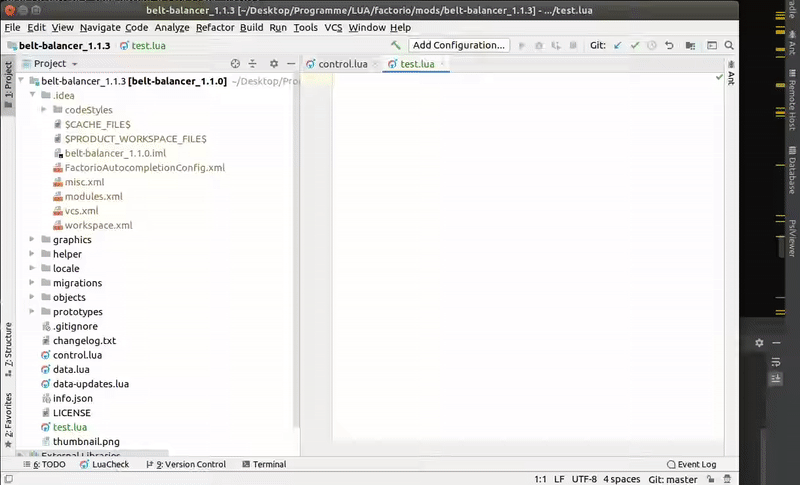

# Intellij Factorio Autocompletion

Fork of abandoned plugin [Factorio LUA API Support](https://plugins.jetbrains.com/plugin/13330-factorio-lua-api-support").

This is a plugin for the jetbrains IDEs. It adds autocompletion to LUA Files for the Factorio LUA-API.

The API has to be downloaded from the Internet, when the Integration is activated. Also the Settings can only be changed, when internet connection is available.
When the Connection is cancelled, while the download is active. The Integration will only be loaded partially and has to be reset, by clicking the button in the Settings.

All Settings are available in `Settings > Languages & Frameworks > Factorio Autocompletion`.

All classes should be available in the autocompletion. To mark a variable as class, you can simply write e.g. `---@type LuaEntity` over it.
All Factorio function, that have a return value, will be also autocompleted.

As Base-LUA-Plugin [emmylua](https://plugins.jetbrains.com/plugin/9768-emmylua) is needed.

Examples:  

# Known Issues
Most of the issues occur, cause the html-API Documention is not consistent :(
- Built-in Types are hardcoded. It is not really possible to parse them from the website.
  Also some are additionally are added, cause the Prototype documentation is inconsistent.
- Prototypes inside `data.raw` are only correctly parsed, after they are downloaded and the IDE is restarted.

## Lua API
- `table` inside `table` not parsed correctly. 
  All types of the sub-table is parsed as additional type for the parameter.
- Some `literal types` are not parsed correctly, they are shown, but not correct. Example: `function LuaRemote.call(interface, func, LuaRemote_call_Param_2) end` where `interface` has 'interface' as literal type.
- All `uint`, `uint8`,  `int`, `int8`, ... are shown as `number`.
- No autocompletion for functions, that are inside `script.on_event`.
- Some Classes out of the `Concepts.html` is not fully parsable (missing elements, i.e. in `Position` and its child-classes.).
- Version 0.12.35 is not correctly parsed, dont use it! I dont think anybody is still developing anything for that old version.

## Prototypes
- ProgrammableSpeaker#instruments not correctly parsed (has a different format than every other table in the wiki)
- Types of the Prototypes are completely inconsistent in layout at therefore only partially parsed!

# Planned features
- Autocompletion for LocalizedStrings
